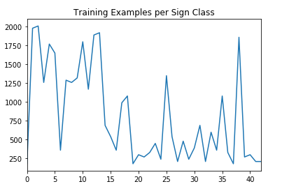
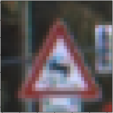
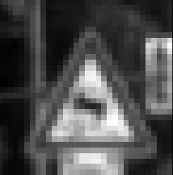
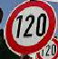
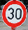
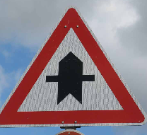
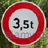
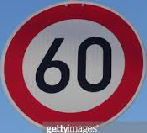

# Build a Traffic Sign Recognition Project

The goals / steps of this project are the following:
* Load the data set (see below for links to the project data set)
* Explore, summarize and visualize the data set
* Design, train and test a model architecture
* Use the model to make predictions on new images
* Analyze the softmax probabilities of the new images
* Summarize the results with a written report

## Rubric Points
### Here I will consider the [rubric points](https://review.udacity.com/#!/rubrics/481/view) individually and describe how I addressed each point in my implementation.  

---
### Writeup / README

#### 1. Provide a Writeup / README that includes all the rubric points and how you addressed each one. You can submit your writeup as markdown or pdf. You can use this template as a guide for writing the report. The submission includes the project code.

You're reading it! and here is a link to my [project code](https://github.com/frankcarey/learning/blob/master/udacity/self-driving/intro_tensorflow/CarND-Traffic-Sign-Classifier-Project/Traffic_Sign_Classifier.ipynb)

### Data Set Summary & Exploration

#### 1. Provide a basic summary of the data set and identify where in your code the summary was done. In the code, the analysis should be done using python, numpy and/or pandas methods rather than hardcoding results manually.

The code for this step is contained in the second code cell of the IPython notebook.  

I used the pandas library to calculate summary statistics of the traffic
signs data set:

* The size of training set is 34799
* The size of test set is 12630
* The shape of a traffic sign image is (32, 32, 3)
* The number of unique classes/labels in the data set is 43

#### 2. Include an exploratory visualization of the dataset and identify where the code is in your code file.

The code for this step is contained in the third code cell of the IPython notebook.  

Here is an exploratory visualization of the data set. It is a bar chart showing how the data ...

### Design and Test a Model Architecture

#### 1. Describe how, and identify where in your code, you preprocessed the image data. What techniques were chosen and why did you choose these techniques? Consider including images showing the output of each preprocessing technique. Pre-processing refers to techniques such as converting to grayscale, normalization, etc.

The code for this step is contained in the fifth code cell of the IPython notebook.

As a first step, I decided to convert the images to grayscale because the ["Traffic Sign Recognition with Multi-Scale Convolutional Networks"](http://yann.lecun.com/exdb/publis/pdf/sermanet-ijcnn-11.pdf) paper said they acheived the best results by converting to YUV and using just the Y channel.

Here is an example of a traffic sign image before and after grayscaling

As a last step, I normalized the image data so that they they all maxed out their values to 255. In this way, the input data that is darker and lighter should be more similar after processing.

#### 2. Describe how, and identify where in your code, you set up training, validation and testing data. How much data was in each set? Explain what techniques were used to split the data into these sets. (OPTIONAL: As described in the "Stand Out Suggestions" part of the rubric, if you generated additional data for training, describe why you decided to generate additional data, how you generated the data, identify where in your code, and provide example images of the additional data)

A separate validation set was already created for us in the data download, so I didn't have to create it myself. The 43 classes were not balanced, so I re-sampled the training set (with replacement) so that each class was equally represented. 

My final training set then went from 35K to 100K images. My validation set and test set had 4410 and 12630 number of images respectively.

(TODO: Data Augmentation)

#### 3. Describe, and identify where in your code, what your final model architecture looks like including model type, layers, layer sizes, connectivity, etc.) Consider including a diagram and/or table describing the final model.

The code for my final model is located in the seventh, eighth, and ninth cell of the ipython notebook. 

My final model consisted of the following layers:

| Layer         		|     Description	        					| 
|:---------------------:|:---------------------------------------------:| 
| Input         		| 32x32x1 Greyscale image   				    | 
| L1 Convolution 5x5    | 1x1 stride, valid padding, outputs 28x28x6	|
| L1 RELU				|												|
| L1 Max pooling	    | 2x2 stride,  outputs 14x14x6 			        |
| L2 Convolution 5x5	| 1x1 stride, valid padding, outputs 10x10x16   |
| L2 RELU				|												|
| L2 Max pooling	    | 2x2 stride,  outputs 5x5x16 (flatten to 400)	|
| L2 Dropout        	| 50% dropout during training       			|
| L3 Fully connected	| 120 nodes        								|
| L4 Fully connected	| 84 nodes        								|
| L5 Fully connected	| 43 nodes        								|
| Softmax				| one-hot encoding        						|
 

#### 4. Describe how, and identify where in your code, you trained your model. The discussion can include the type of optimizer, the batch size, number of epochs and any hyperparameters such as learning rate.

The code for training the model is located in the eleventh and twelfth cell of the ipython notebook. 

To train the model, I used an "AdaM" Optimizer or Adagrad + Momentum with a learning rate of 0.0007, batch size of 128, and 30 epochs. I also used dropout of 50% during training.

#### 5. Describe the approach taken for finding a solution. Include in the discussion the results on the training, validation and test sets and where in the code these were calculated. Your approach may have been an iterative process, in which case, outline the steps you took to get to the final solution and why you chose those steps. Perhaps your solution involved an already well known implementation or architecture. In this case, discuss why you think the architecture is suitable for the current problem.

The code for calculating the accuracy of the model is located in the twelfth cell of the Ipython notebook.

My final model results were:
* training set accuracy of 99.857%
* validation set accuracy of 95.42%
* test set accuracy of 93.87%

##### If an iterative approach was chosen:

* **What was the first architecture that was tried and why was it chosen?** The first architecture tried is basically a LeNet-5 architecture, but using relu instead of tanh activations. It was a simple architecture to start with.
* **What were some problems with the initial architecture?** Generally, this architecture worked well enough to get a 93% validation score with a 99.9% training score, so It was overfitting a bit. The state of the art seems to be in the +98% range, so I tried other things.
* **How was the architecture adjusted and why was it adjusted? Typical adjustments could include choosing a different model architecture, adding or taking away layers (pooling, dropout, convolution, etc), using an activation function or changing the activation function. One common justification for adjusting an architecture would be due to over fitting or under fitting. A high accuracy on the training set but low accuracy on the validation set indicates over fitting; a low accuracy on both sets indicates under fitting.** The first thing I implemented was dropout to the end of layer 4. That helped to decrease the over-fitting. The "sermanet" paper also described combining the output of the two convolutional layers into a single set of activations by concatinating them together. That didn't seem to make a positive difference and instead increased the over-fitting. I ended up removing that and moving the dropout after the l2 max pooling layer.
* **Which parameters were tuned? How were they adjusted and why?** I varied the epoch, batch size, learning, and dropout rates to improve the results. The learning rate needed to be adjusted any time I make a significant change to the architecture, but generally worked well in the 0.0002 - 0.001 range. I could see how fast things converged during training and tried to reduce the number so that the end results didn't bounce around that much. Batch size was increased to the maximum amount without the GPU running out of memory. Dropout in the 30-50% range seemed to work best. Similarly, the number of epochs needed to change based on other variables like architecture, dropout, and learning rate. It generally needed to be increased when a dropout layer was added, when the amount of dropout increased, or when then learning rate went down.
* **What are some of the important design choices and why were they chosen? For example, why might a convolution layer work well with this problem? How might a dropout layer help with creating a successful model?** The convolution layers work well on image data where locality is important and are much more space efficient than a fully-connected approach since the convolution weights are shared. Dropout helps with regularization and limiting over-fitting. Since the model can't rely on specific neurons to be active during any training pass, that knowledge basically gets spread more evenly through the model.
 
### Test a Model on New Images

#### 1. Choose five German traffic signs found on the web and provide them in the report. For each image, discuss what quality or qualities might be difficult to classify.

Here are five German traffic signs that I found on the web:

I also added a sign that isn't a german road sign out of curiosity.

The 120 km/hr image might be difficult to classify because the image is slightly askew, and the 60 km/hr has a bit of a shadow across the sign.

#### 2. Discuss the model's predictions on these new traffic signs and compare the results to predicting on the test set. Identify where in your code predictions were made. At a minimum, discuss what the predictions were, the accuracy on these new predictions, and compare the accuracy to the accuracy on the test set (OPTIONAL: Discuss the results in more detail as described in the "Stand Out Suggestions" part of the rubric).

The code for making predictions on my final model is located in the tenth cell of the Ipython notebook.

Here are the results of the prediction:

| Image			        |     Prediction	        					| 
|:---------------------:|:---------------------------------------------:| 
| 120 km/h      		| 60 km/h   									| 
| 30 km/h     			| 30 km/h 										|
| Right-of-way			| Right-of-way									|
| 3.5 Ton prohibit	    | 3.5 metric tons prohibited  					|
| 60 km/h			    | end of 80 km/hr     							|

The model was able to correctly guess 3 of the 5 traffic signs, which gives an accuracy of 60%. This is lower than the test set of 93%

#### 3. Describe how certain the model is when predicting on each of the five new images by looking at the softmax probabilities for each prediction and identify where in your code softmax probabilities were outputted. Provide the top 5 softmax probabilities for each image along with the sign type of each probability. (OPTIONAL: as described in the "Stand Out Suggestions" part of the rubric, visualizations can also be provided such as bar charts)

The code for making predictions on my final model is located in the 20th cell of the Ipython notebook.

The first image was for a 120 km/h sign and the model is very sure that this is a 60 km/h sign (probability of 0.99), but it wasn't. While most of the predictions were for speed signs, the proper prediction of 120 km/h wasn't even in the top 5.

| Probability         	|     Prediction	        					| 
|:---------------------:|:---------------------------------------------:| 
| .99         			| 60 km/h   									| 
| .00     				| 80 km/h 										|
| .00					| 100 km/h					    				|
| .00	      			| 50 km/h					        			|
| .00				    | 3.5 tons no passing         					|

The second image was 30 km/h which the model correctly predicts and is effectively 100% confident.
 
| Probability         	|     Prediction	        					| 
|:---------------------:|:---------------------------------------------:| 
| 1.0         			| 30 km/h   									| 
| .0     				| 50 km/h 										|
| .0					| 20 km/h				    					|
| .0	      			| keep right		    			 			|
| .0				    | roundabout mandatory      					|

The third image is also correctly predicted with high confidence as a right-of-way sign.

| Probability         	|     Prediction	        					| 
|:---------------------:|:---------------------------------------------:| 
| 1.0       			| Right-of-way   								| 
| .0     				| priority road 								|
| .0					| beware ice / snow								|
| .0	      			| slippery road					 			    |
| .0				    | road work     					            |

The forth was a "3.5 metric tons prohibited" sign, which was predicted correctly with 95% confidence.

| Probability         	|     Prediction	        					| 
|:---------------------:|:---------------------------------------------:| 
| .9507    			    | 3.5 metric tons prohibited     				|
| .0493     			| 30 hm/h 										|
| .0					| 20 km/h						    			|
| .0	      			| 70 km/h				        	 			|
| .0				    | keep right                 					|

Similarly, the fifth item was incorrectly predicted with high confidence by the model as and end of 80 km/hr instead of 60 km/h, but at least the signs were similar as it got it correct with the second guess.
 
| Probability         	|     Prediction	        					| 
|:---------------------:|:---------------------------------------------:| 
| .9996      			| end of 80 km/hr								| 
| .0004     			| 60 km/h 										|
| .0					| 80 km/h									    |
| .0	      			| 30 km/h					 			        |
| .0				    | 20 km/h     					                |